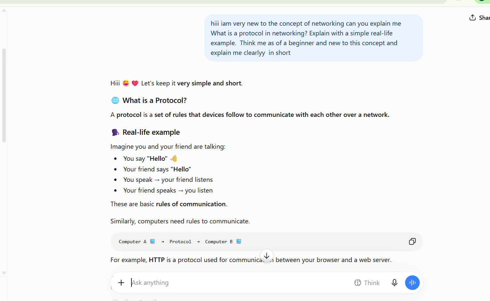
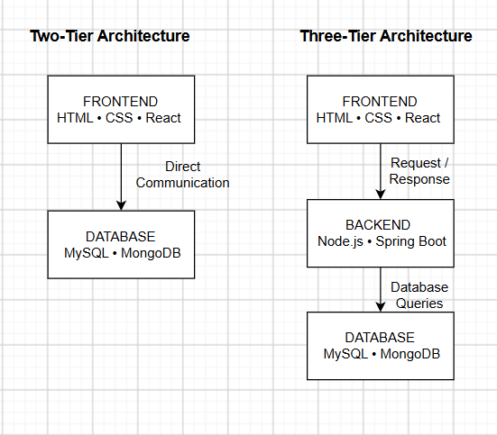
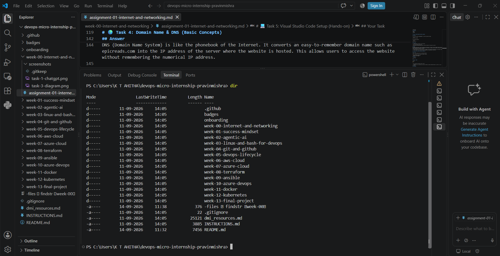

# Week 00 - Internet and Networking

Part of the DevOps Micro Internship (DMI) Cohort 3 with Agentic AI

---

# 🧑‍💻 Task 1: Using ChatGPT as Your Learning Assistant

## Scenario

You're new to DevOps and will frequently encounter technical questions. ChatGPT can be your learning companion.

## Your Task

Write a clear ChatGPT prompt to help you understand:

> "What is a protocol in networking? Explain with a simple real-life example."

Take a screenshot of your interaction showing:

* Your detailed prompt (with clear expectations)
* ChatGPT's simplified response with an example

## Screenshot

Save your screenshot in the `screenshots` folder and update the file name below.



---

## What I Learned (2–3 lines)

I learned that a protocol is a set of rules that helps devices communicate with each other over a network.
It is similar to people following common rules while talking so that both sides can understand each other.

# 🌐 Task 2: Internet and Networking

## Scenario

Your friend is launching an online bookstore named **EpicReads**.

He asked you to explain how users globally can access his website hosted in Finland.

## Your Task

Write a short explanation (**100–150 words**) that includes:

* Packet Switching
* IP Address
* TCP/IP
* HTTP/HTTPS

💡 **Tip:** You may use ChatGPT (as demonstrated in Task 1) to refine your explanation.

## Answer

When a user in the USA opens the EpicReads website, the request travels through the Internet to the server located in Finland. First, the website’s IP address helps identify the destination server, similar to a postal address. The data is divided into small pieces called packets. This is known as packet switching, where packets can travel through different network paths and are reassembled at the destination.

TCP/IP is the main set of communication rules that helps send these packets correctly from the USA to Finland. TCP ensures the data arrives properly, while IP handles addressing and routing. Finally, HTTP or HTTPS is used for communication between the user's browser and the EpicReads server. HTTPS also encrypts the communication, making it more secure.

# 🏗️ Task 3: Application Architecture & Stack

## Scenario

EpicReads bookstore has two application versions:

### Two-Tier Application

* Frontend
* Database

### Three-Tier Application

* Frontend
* Backend
* Database

## Your Task

* Draw simple diagrams (hand-drawn or tool-based such as draw.io)
* Label each layer clearly
* List at least two common technologies or tools used for each layer
* Submit a screenshot or photo clearly showing your own drawing

## Diagram Screenshot / Photo





---

## Technologies Used

### Frontend

-HTML
-CSS
-React

### Backend

-Node.js
-Spring Boot

### Database

-MySQL
-MongoDB

---

# 🌍 Task 4: Domain Name & DNS (Basic Concepts)

## Scenario

Your friend's bookstore **EpicReads** is currently accessible through:

```text
52.172.142.222:3000
```

He purchased the domain:

```text
epicreads.com
```

## Your Task

In **50–100 words**, explain in your own words:

1. What is DNS (Domain Name System)?
2. Which DNS record type should be used to connect the domain to the given IP, and why?

## Answer

DNS (Domain Name System) is like the phonebook of the Internet. It converts an easy-to-remember domain name such as epicreads.com into the IP address of the server where the website is hosted. This allows users to access the website without remembering the numerical IP address.

To connect epicreads.com to 52.172.142.222, an A (Address) record should be used because an A record maps a domain name to an IPv4 address. The port 3000 is handled separately by the application or web server.

# 💻 Task 5: Visual Studio Code Setup (Hands-on)

## Your Task

Install Visual Studio Code (if not already installed).

Take a screenshot of your VS Code environment showing:

* Terminal open inside VS Code
* Running a basic command:

### Windows

```powershell
dir
```

### Linux / macOS

```bash
pwd
ls
```

* Your selected VS Code theme clearly visible

⚠️ **Important:** The screenshot must show your username or another identifiable detail to confirm it is your environment.

## Screenshot

Save your screenshot in the `screenshots` folder and update the file name below.




# 🔗 Task 6: Publish Your Assignment as a LinkedIn Post

## Objective

Publishing on LinkedIn helps you:

* Build your professional online presence
* Reinforce your learning
* Document your DevOps journey publicly

## Your Task

Summarize your answers from Tasks 1–5 into a LinkedIn post.

Clearly structure your post into the following sections:

* ChatGPT
* Internet & Networking
* App Architecture
* DNS
* VS Code Setup

Use the credit note that matches your track:

Add the following credit note at the end of your post **(If you are DMI Cohort 3 student)**:

> **P.S. This post is part of the DevOps Micro Internship (DMI) with Agentic AI — Cohort 3 — by Pravin Mishra. My graded progress is public: https://dmi.pravinmishra.com/s/YOUR-GITHUB-USERNAME.html · Start your DevOps journey: https://dmi.pravinmishra.com/?utm_source=student&utm_medium=ps-linkedin&utm_campaign=cohort3**

**Tag [Pravin Mishra](https://www.linkedin.com/in/pravin-mishra-aws-trainer/) in your LinkedIn post, then tag Lead Co-Mentor — [Anjana Muthunayake](https://www.linkedin.com/in/anjana-muthunayake/).**

Add the following credit note at the end of your post **(If you are DMI Self-paced track student)**:

> **P.S. This post is part of the DevOps Micro Internship (DMI) — Self-Paced Engineer Track — by Pravin Mishra. My graded progress is public: https://dmi.pravinmishra.com/s/YOUR-GITHUB-USERNAME.html · Start your DevOps journey: https://dmi.pravinmishra.com/?utm_source=student&utm_medium=ps-linkedin&utm_campaign=self-paced**

Add the following credit note at the end of your post **(If you are DMI Campus student)**:

> **P.S. This post is part of the DevOps Micro Internship (DMI) — Campus — by Pravin Mishra. My graded progress is public: https://dmi.pravinmishra.com/s/YOUR-GITHUB-USERNAME.html · Start your DevOps journey: https://dmi.pravinmishra.com/?utm_source=student&utm_medium=ps-linkedin&utm_campaign=campus**

**Tag [Pravin Mishra](https://www.linkedin.com/in/pravin-mishra-aws-trainer/) in your LinkedIn post, then tag Lead Co-Mentor — [Anjana Muthunayake](https://www.linkedin.com/in/anjana-muthunayake/).**

Hashtags:

#DMIByPravinMishra #AgenticAI #DevOps

Replace `YOUR-GITHUB-USERNAME` with your GitHub username — that link is your public DMI progress page (your graded badge page).
---

## LinkedIn Post URL

Paste your LinkedIn post URL here:

```text
https://lnkd.in/p/ghrAztq8
```

---

## LinkedIn Post Backup Copy

Paste the full text of your LinkedIn post here:

Week 0 – DevOps Micro Internship
Completed my Week 0 tasks as part of the DevOps Micro Internship and gained a better understanding of the fundamentals of Internet, Networking, and DevOps.
ChatGPT
Learned how to use ChatGPT effectively as a learning assistant for understanding technical concepts, simplifying complex topics, and improving my learning process.
Internet & Networking
Worked through the basics of networking, including packet switching, IP addresses, TCP/IP, HTTP/HTTPS, and how users can access websites hosted on remote servers.
Application Architecture
Learned the basics of two-tier and three-tier application architecture and understood how the frontend, backend, and database interact with each other.
DNS
Learned how DNS works and how domain names are resolved to IP addresses. I also understood the role of A records in connecting a domain to an IPv4 address.
VS Code Setup
Set up and worked with my development environment in VS Code and practiced using the integrated terminal and basic commands.
I have also attached some of the diagrams and screenshots from my Week 0 work as evidence of what I completed.
Looking forward to continuing with the upcoming tasks and gaining more hands-on experience with DevOps.
P.S. This post is part of the DevOps Micro Internship (DMI) — Self-Paced Engineer Track — by Pravin Mishra. 
Start your DevOps journey: https://lnkd.in/gai5MXr9
#DMIByPravinMishra #DevOps #Networking #DNS #VSCode #Learning
---

# Reflection – Week 0

### What did you find easy?

I found it easy to understand basic networking concepts such as IP addresses, DNS, HTTP/HTTPS, and using the VS Code terminal.

---

### What was difficult?

Understanding how different networking components work together and creating the application architecture diagram was initially difficult, but I understood them better through practice.

---

### What will you improve next week?

Next week, I will improve my command-line skills, Git and GitHub knowledge, and learn more about DevOps tools through hands-on practice.

---

## 📌 About DMI & CloudAdvisory

DevOps Micro Internship (DMI) is a project-based DevOps program run by Pravin Mishra (The CloudAdvisory) focused on real-world execution, systems thinking, and career readiness.

It helps learners build strong DevOps foundations with hands-on experience.


## 📌 Resources

- 🌐 **DMI Official Website:** https://dmi.pravinmishra.com?utm_source=github&utm_medium=readme  
- 🎓 **University:** https://university.pravinmishra.com?utm_source=github&utm_medium=readme  
- 💬 **Discord Community:** https://discord.pravinmishra.com?utm_source=github&utm_medium=readme  
- 📝 **Blog:** https://dmi.pravinmishra.com/blog?utm_source=github&utm_medium=readme  
- ▶️ **YouTube Playlist (DMI Cohort 3):** https://www.youtube.com/playlist?list=PLFeSNDtI4Cho  
- 🔗 **Pravin Mishra (LinkedIn):** https://www.linkedin.com/in/pravin-mishra-aws-trainer/  
- 🏢 **CloudAdvisory (LinkedIn):** https://www.linkedin.com/company/thecloudadvisory/

---

*This submission is part of DevOps Micro Internship (DMI) Cohort 3 — Agentic AI Track*